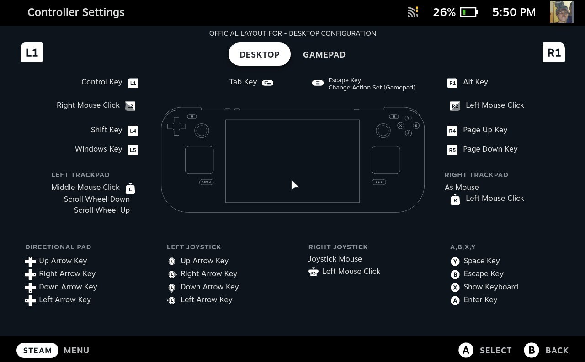

As a steam deck user I quickly realized that it would be cool to have diffrent streaming services apps on it. Its hard to expect from all of these companies to develop their clients applications for this specific device. However steam deck is fully functional PC so we can just use browser to use their website. The only probelm with that is just these interfaces were desinged to use them with mouse and keyboard, not with gamepad. Initially I wanted to write my own youtube client but its much less work to just do a plugin that based on steam deck inputs interacts with website in a way that match hand helded device. This project is basically overview how application like this could behave.

# Steam Deck layout

Steam Deck is translating its input to keyboad events. Because of that in [steamdeck.js](./steamdeck.js) file we provide translation from steam deck inputs to javascript key strings.

# Testing

Go to `chrome://extensions/`, enable **Developer Mode**, use `Load unpacked` to point to this repository and reload.
